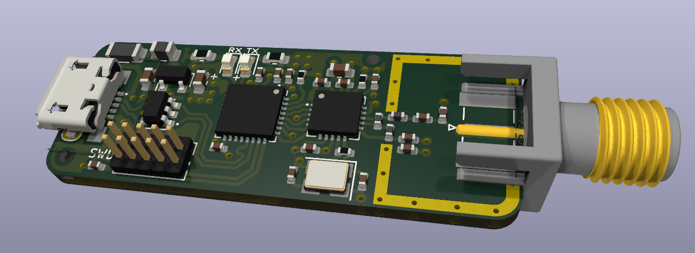
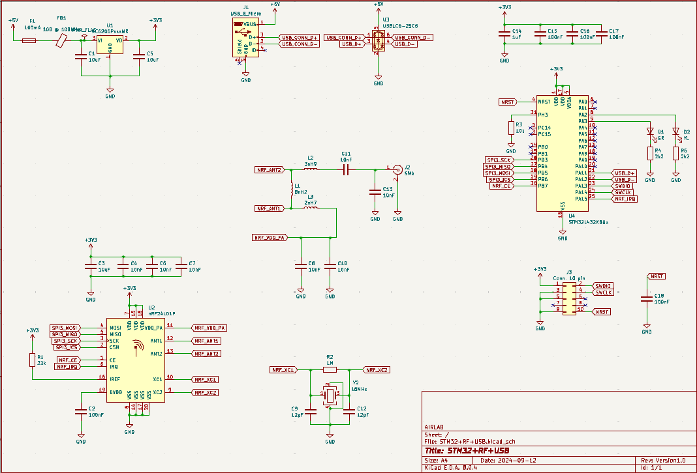

# STM32+RF+USB with-KiCad
* STM32 + RF + USB System
This project integrates an STM32 microcontroller with RF communication and USB connectivity. 
The STM32 handles control and data processing, while the RF module enables wireless communication. 
The USB interface allows for data transfer and connection with computers. This setup is ideal for IoT and remote control applications.

# Shematic

